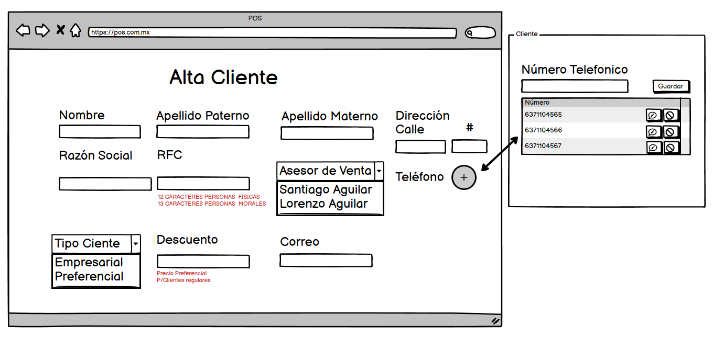
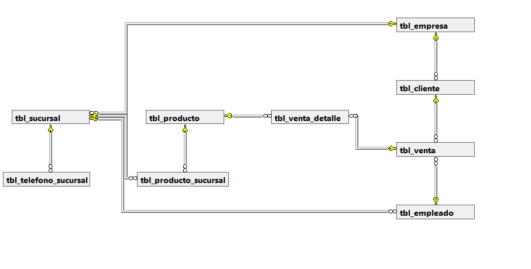
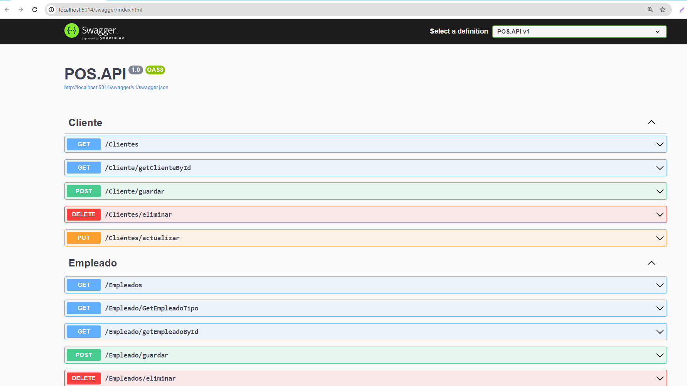
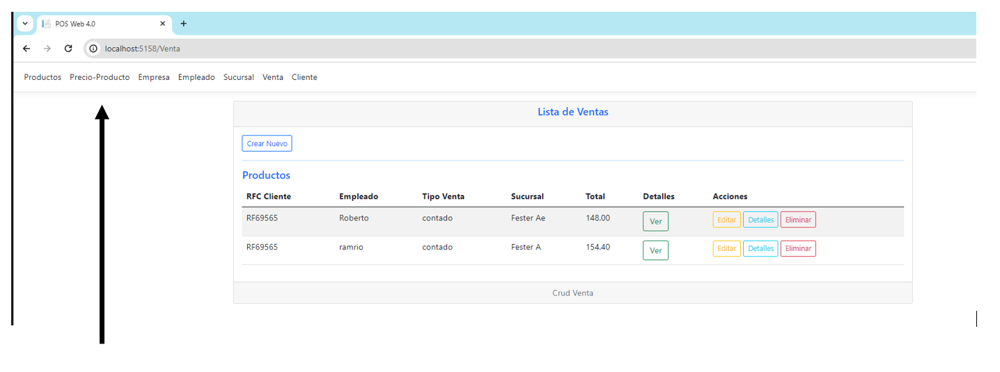
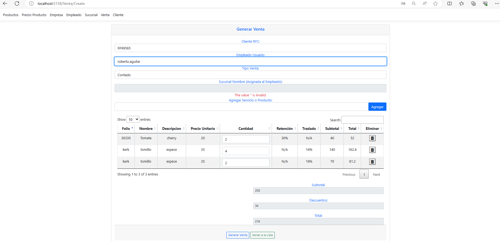
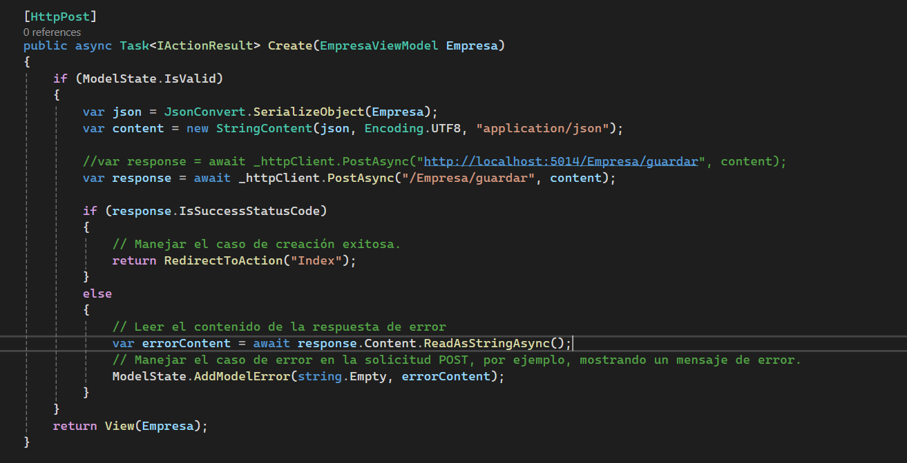
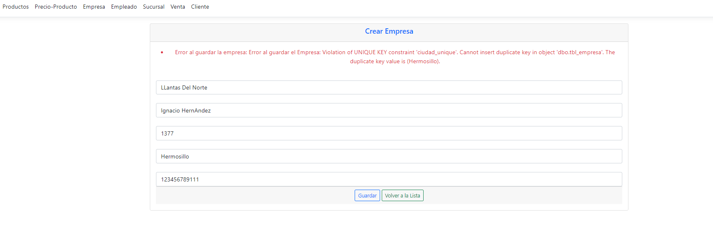
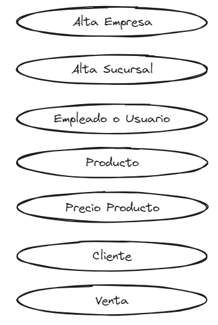

# POSWeb
Proyecto punto de venta

Proyecto Web, tipo API.

# Bosquejo CRUD Cliente del diseño Front-End "Tentativo"


# Diagrama entidad relación

 

# Script para generar el esquema de la base de datos

```sql
USE [pos_db]
GO
/****** Object:  Table [dbo].[tbl_cliente]    Script Date: 5/15/2024 10:45:04 AM ******/
SET ANSI_NULLS ON
GO
SET QUOTED_IDENTIFIER ON
GO
CREATE TABLE [dbo].[tbl_cliente](
	[id_cliente] [int] IDENTITY(1,1) NOT NULL,
	[apellido_paterno] [varchar](50) NOT NULL,
	[apellido_materno] [varchar](50) NOT NULL,
	[nombre_cliente] [varchar](50) NOT NULL,
	[rfc_cliente] [varchar](50) NOT NULL,
	[calle_direccion_cliente] [varchar](30) NOT NULL,
	[numero_direcion_ciente] [int] NOT NULL,
	[id_empresa] [int] NOT NULL,
	[tipo_cliente] [varchar](15) NOT NULL,
	[eliminado] [bit] NOT NULL,
	[descuento] [decimal](5, 2) NOT NULL,
	[id_empleado] [int] NOT NULL,
 CONSTRAINT [PK_tbl_cliente] PRIMARY KEY CLUSTERED 
(
	[id_cliente] ASC
)WITH (PAD_INDEX = OFF, STATISTICS_NORECOMPUTE = OFF, IGNORE_DUP_KEY = OFF, ALLOW_ROW_LOCKS = ON, ALLOW_PAGE_LOCKS = ON, OPTIMIZE_FOR_SEQUENTIAL_KEY = OFF) ON [PRIMARY],
 CONSTRAINT [cliente_rfc_unique] UNIQUE NONCLUSTERED 
(
	[rfc_cliente] ASC
)WITH (PAD_INDEX = OFF, STATISTICS_NORECOMPUTE = OFF, IGNORE_DUP_KEY = OFF, ALLOW_ROW_LOCKS = ON, ALLOW_PAGE_LOCKS = ON, OPTIMIZE_FOR_SEQUENTIAL_KEY = OFF) ON [PRIMARY]
) ON [PRIMARY]
GO
/****** Object:  Table [dbo].[tbl_empleado]    Script Date: 5/15/2024 10:45:04 AM ******/
SET ANSI_NULLS ON
GO
SET QUOTED_IDENTIFIER ON
GO
CREATE TABLE [dbo].[tbl_empleado](
	[id_empleado] [int] IDENTITY(1,1) NOT NULL,
	[nombre_empleado] [varchar](50) NOT NULL,
	[apellido_paterno] [varchar](50) NOT NULL,
	[apellido_materno] [varchar](50) NOT NULL,
	[usuario_sistema] [varchar](50) NOT NULL,
	[contrasena_sistema] [nchar](36) NOT NULL,
	[nss] [nchar](11) NOT NULL,
	[id_sucursal] [int] NOT NULL,
	[tipo_usuario] [varchar](50) NOT NULL,
	[eliminado] [bit] NOT NULL,
 CONSTRAINT [PK_tbl_empleado] PRIMARY KEY CLUSTERED 
(
	[id_empleado] ASC
)WITH (PAD_INDEX = OFF, STATISTICS_NORECOMPUTE = OFF, IGNORE_DUP_KEY = OFF, ALLOW_ROW_LOCKS = ON, ALLOW_PAGE_LOCKS = ON, OPTIMIZE_FOR_SEQUENTIAL_KEY = OFF) ON [PRIMARY]
) ON [PRIMARY]
GO
/****** Object:  Table [dbo].[tbl_empresa]    Script Date: 5/15/2024 10:45:04 AM ******/
SET ANSI_NULLS ON
GO
SET QUOTED_IDENTIFIER ON
GO
CREATE TABLE [dbo].[tbl_empresa](
	[id_empresa] [int] IDENTITY(1,1) NOT NULL,
	[razon_social_empresa] [nchar](30) NOT NULL,
	[calle_direccion_empresa] [varchar](30) NOT NULL,
	[numero_direccion_empresa] [int] NOT NULL,
	[ciudad_empresa] [varchar](30) NOT NULL,
	[rfc_empresa] [nchar](13) NOT NULL,
	[eliminado] [bit] NOT NULL,
 CONSTRAINT [PK_tbl_empresa] PRIMARY KEY CLUSTERED 
(
	[id_empresa] ASC
)WITH (PAD_INDEX = OFF, STATISTICS_NORECOMPUTE = OFF, IGNORE_DUP_KEY = OFF, ALLOW_ROW_LOCKS = ON, ALLOW_PAGE_LOCKS = ON, OPTIMIZE_FOR_SEQUENTIAL_KEY = OFF) ON [PRIMARY],
 CONSTRAINT [ciudad_unique] UNIQUE NONCLUSTERED 
(
	[ciudad_empresa] ASC
)WITH (PAD_INDEX = OFF, STATISTICS_NORECOMPUTE = OFF, IGNORE_DUP_KEY = OFF, ALLOW_ROW_LOCKS = ON, ALLOW_PAGE_LOCKS = ON, OPTIMIZE_FOR_SEQUENTIAL_KEY = OFF) ON [PRIMARY]
) ON [PRIMARY]
GO
/****** Object:  Table [dbo].[tbl_producto]    Script Date: 5/15/2024 10:45:04 AM ******/
SET ANSI_NULLS ON
GO
SET QUOTED_IDENTIFIER ON
GO
CREATE TABLE [dbo].[tbl_producto](
	[id_producto] [int] IDENTITY(1,1) NOT NULL,
	[folio_producto] [nvarchar](10) NOT NULL,
	[descripcion_producto] [varchar](50) NOT NULL,
	[tipo_producto] [nvarchar](10) NOT NULL,
	[eliminado] [bit] NOT NULL,
	[retencion] [bit] NOT NULL,
	[traslado] [bit] NOT NULL,
	[tipo_impuesto] [nvarchar](10) NOT NULL,
	[tiene_impuesto] [bit] NOT NULL,
	[nombre_producto] [varchar](30) NOT NULL,
 CONSTRAINT [PK_tbl_producto] PRIMARY KEY CLUSTERED 
(
	[id_producto] ASC
)WITH (PAD_INDEX = OFF, STATISTICS_NORECOMPUTE = OFF, IGNORE_DUP_KEY = OFF, ALLOW_ROW_LOCKS = ON, ALLOW_PAGE_LOCKS = ON, OPTIMIZE_FOR_SEQUENTIAL_KEY = OFF) ON [PRIMARY]
) ON [PRIMARY]
GO
/****** Object:  Table [dbo].[tbl_producto_sucursal]    Script Date: 5/15/2024 10:45:04 AM ******/
SET ANSI_NULLS ON
GO
SET QUOTED_IDENTIFIER ON
GO
CREATE TABLE [dbo].[tbl_producto_sucursal](
	[precio] [money] NOT NULL,
	[id_producto] [int] NOT NULL,
	[id_sucursal] [int] NOT NULL,
	[eliminado] [bit] NOT NULL,
 CONSTRAINT [PK_tbl_producto_sucursal_1] PRIMARY KEY CLUSTERED 
(
	[id_producto] ASC,
	[id_sucursal] ASC
)WITH (PAD_INDEX = OFF, STATISTICS_NORECOMPUTE = OFF, IGNORE_DUP_KEY = OFF, ALLOW_ROW_LOCKS = ON, ALLOW_PAGE_LOCKS = ON, OPTIMIZE_FOR_SEQUENTIAL_KEY = OFF) ON [PRIMARY]
) ON [PRIMARY]
GO
/****** Object:  Table [dbo].[tbl_sucursal]    Script Date: 5/15/2024 10:45:04 AM ******/
SET ANSI_NULLS ON
GO
SET QUOTED_IDENTIFIER ON
GO
CREATE TABLE [dbo].[tbl_sucursal](
	[id_sucursal] [int] IDENTITY(1,1) NOT NULL,
	[calle_direccion_sucursal] [varchar](30) NOT NULL,
	[numero_direccion_sucursal] [int] NOT NULL,
	[rfc_sucursal] [nvarchar](13) NOT NULL,
	[razon_social_sucursal] [varchar](50) NOT NULL,
	[centro_costo_sucursal] [varchar](50) NOT NULL,
	[nombre_sucursal] [varchar](50) NOT NULL,
	[Id_empresa] [int] NOT NULL,
	[eliminado] [bit] NOT NULL,
 CONSTRAINT [PK_tbl_sucursal] PRIMARY KEY CLUSTERED 
(
	[id_sucursal] ASC
)WITH (PAD_INDEX = OFF, STATISTICS_NORECOMPUTE = OFF, IGNORE_DUP_KEY = OFF, ALLOW_ROW_LOCKS = ON, ALLOW_PAGE_LOCKS = ON, OPTIMIZE_FOR_SEQUENTIAL_KEY = OFF) ON [PRIMARY]
) ON [PRIMARY]
GO
/****** Object:  Table [dbo].[tbl_telefono_empresa]    Script Date: 5/15/2024 10:45:04 AM ******/
SET ANSI_NULLS ON
GO
SET QUOTED_IDENTIFIER ON
GO
CREATE TABLE [dbo].[tbl_telefono_empresa](
	[id_empresa] [int] NOT NULL,
	[telefono_empresa] [varchar](20) NOT NULL,
 CONSTRAINT [PK_tbl_telefono_empresa] PRIMARY KEY CLUSTERED 
(
	[id_empresa] ASC,
	[telefono_empresa] ASC
)WITH (PAD_INDEX = OFF, STATISTICS_NORECOMPUTE = OFF, IGNORE_DUP_KEY = OFF, ALLOW_ROW_LOCKS = ON, ALLOW_PAGE_LOCKS = ON, OPTIMIZE_FOR_SEQUENTIAL_KEY = OFF) ON [PRIMARY]
) ON [PRIMARY]
GO
/****** Object:  Table [dbo].[tbl_telefono_sucursal]    Script Date: 5/15/2024 10:45:04 AM ******/
SET ANSI_NULLS ON
GO
SET QUOTED_IDENTIFIER ON
GO
CREATE TABLE [dbo].[tbl_telefono_sucursal](
	[id_sucursal] [int] NOT NULL,
	[telefono_sucursal] [varchar](20) NOT NULL,
 CONSTRAINT [PK_tbl_telefono_sucursal] PRIMARY KEY CLUSTERED 
(
	[id_sucursal] ASC,
	[telefono_sucursal] ASC
)WITH (PAD_INDEX = OFF, STATISTICS_NORECOMPUTE = OFF, IGNORE_DUP_KEY = OFF, ALLOW_ROW_LOCKS = ON, ALLOW_PAGE_LOCKS = ON, OPTIMIZE_FOR_SEQUENTIAL_KEY = OFF) ON [PRIMARY]
) ON [PRIMARY]
GO
/****** Object:  Table [dbo].[tbl_venta]    Script Date: 5/15/2024 10:45:04 AM ******/
SET ANSI_NULLS ON
GO
SET QUOTED_IDENTIFIER ON
GO
CREATE TABLE [dbo].[tbl_venta](
	[id_venta] [int] IDENTITY(1,1) NOT NULL,
	[tipo_venta] [nvarchar](10) NOT NULL,
	[id_cliente] [int] NOT NULL,
	[id_empleado] [int] NOT NULL,
	[fecha_venta] [datetime] NOT NULL,
	[total_venta] [decimal](10, 2) NOT NULL,
	[eliminado] [bit] NOT NULL,
 CONSTRAINT [PK_tbl_venta] PRIMARY KEY CLUSTERED 
(
	[id_venta] ASC
)WITH (PAD_INDEX = OFF, STATISTICS_NORECOMPUTE = OFF, IGNORE_DUP_KEY = OFF, ALLOW_ROW_LOCKS = ON, ALLOW_PAGE_LOCKS = ON, OPTIMIZE_FOR_SEQUENTIAL_KEY = OFF) ON [PRIMARY]
) ON [PRIMARY]
GO
/****** Object:  Table [dbo].[tbl_venta_detalle]    Script Date: 5/15/2024 10:45:04 AM ******/
SET ANSI_NULLS ON
GO
SET QUOTED_IDENTIFIER ON
GO
CREATE TABLE [dbo].[tbl_venta_detalle](
	[id_venta_detalle] [int] IDENTITY(1,1) NOT NULL,
	[id_venta] [int] NOT NULL,
	[id_producto] [int] NOT NULL,
	[precio_unitario] [decimal](10, 2) NOT NULL,
	[subtotal] [decimal](10, 2) NOT NULL,
	[eliminado] [bit] NOT NULL,
	[cantidad] [int] NOT NULL,
 CONSTRAINT [PK_tbl_venta_detalle] PRIMARY KEY CLUSTERED 
(
	[id_venta_detalle] ASC
)WITH (PAD_INDEX = OFF, STATISTICS_NORECOMPUTE = OFF, IGNORE_DUP_KEY = OFF, ALLOW_ROW_LOCKS = ON, ALLOW_PAGE_LOCKS = ON, OPTIMIZE_FOR_SEQUENTIAL_KEY = OFF) ON [PRIMARY]
) ON [PRIMARY]
GO
ALTER TABLE [dbo].[tbl_cliente] ADD  CONSTRAINT [DF__tbl_clien__elimi__45BE5BA9]  DEFAULT ((0)) FOR [eliminado]
GO
ALTER TABLE [dbo].[tbl_empleado] ADD  CONSTRAINT [DF__tbl_emple__elimi__489AC854]  DEFAULT ((0)) FOR [eliminado]
GO
ALTER TABLE [dbo].[tbl_empresa] ADD  CONSTRAINT [DF__tbl_empre__elimi__46B27FE2]  DEFAULT ((0)) FOR [eliminado]
GO
ALTER TABLE [dbo].[tbl_producto] ADD  CONSTRAINT [DF__tbl_produ__elimi__498EEC8D]  DEFAULT ((0)) FOR [eliminado]
GO
ALTER TABLE [dbo].[tbl_producto] ADD  CONSTRAINT [DF__tbl_produ__reten__3B40CD36]  DEFAULT ((0)) FOR [retencion]
GO
ALTER TABLE [dbo].[tbl_producto] ADD  CONSTRAINT [DF__tbl_produ__trasl__3C34F16F]  DEFAULT ((0)) FOR [traslado]
GO
ALTER TABLE [dbo].[tbl_producto] ADD  CONSTRAINT [DF__tbl_produ__tiene__3D2915A8]  DEFAULT ((0)) FOR [tiene_impuesto]
GO
ALTER TABLE [dbo].[tbl_sucursal] ADD  CONSTRAINT [DF__tbl_sucur__elimi__47A6A41B]  DEFAULT ((0)) FOR [eliminado]
GO
ALTER TABLE [dbo].[tbl_venta] ADD  DEFAULT ((0)) FOR [eliminado]
GO
ALTER TABLE [dbo].[tbl_venta_detalle] ADD  DEFAULT ((0)) FOR [eliminado]
GO
ALTER TABLE [dbo].[tbl_cliente]  WITH CHECK ADD  CONSTRAINT [FK_tbl_cliente_tbl_empresa] FOREIGN KEY([id_empresa])
REFERENCES [dbo].[tbl_empresa] ([id_empresa])
GO
ALTER TABLE [dbo].[tbl_cliente] CHECK CONSTRAINT [FK_tbl_cliente_tbl_empresa]
GO
ALTER TABLE [dbo].[tbl_empleado]  WITH CHECK ADD  CONSTRAINT [FK_tbl_empleado_tbl_sucursal] FOREIGN KEY([id_sucursal])
REFERENCES [dbo].[tbl_sucursal] ([id_sucursal])
GO
ALTER TABLE [dbo].[tbl_empleado] CHECK CONSTRAINT [FK_tbl_empleado_tbl_sucursal]
GO
ALTER TABLE [dbo].[tbl_producto_sucursal]  WITH CHECK ADD  CONSTRAINT [FK_tbl_producto_sucursal_tbl_producto] FOREIGN KEY([id_producto])
REFERENCES [dbo].[tbl_producto] ([id_producto])
GO
ALTER TABLE [dbo].[tbl_producto_sucursal] CHECK CONSTRAINT [FK_tbl_producto_sucursal_tbl_producto]
GO
ALTER TABLE [dbo].[tbl_producto_sucursal]  WITH CHECK ADD  CONSTRAINT [FK_tbl_producto_sucursal_tbl_sucursal] FOREIGN KEY([id_sucursal])
REFERENCES [dbo].[tbl_sucursal] ([id_sucursal])
GO
ALTER TABLE [dbo].[tbl_producto_sucursal] CHECK CONSTRAINT [FK_tbl_producto_sucursal_tbl_sucursal]
GO
ALTER TABLE [dbo].[tbl_sucursal]  WITH CHECK ADD  CONSTRAINT [FK_tbl_sucursal_tbl_empresa] FOREIGN KEY([Id_empresa])
REFERENCES [dbo].[tbl_empresa] ([id_empresa])
GO
ALTER TABLE [dbo].[tbl_sucursal] CHECK CONSTRAINT [FK_tbl_sucursal_tbl_empresa]
GO
ALTER TABLE [dbo].[tbl_telefono_empresa]  WITH CHECK ADD  CONSTRAINT [FK_tbl_telefono_empresa_tbl_empresa] FOREIGN KEY([id_empresa])
REFERENCES [dbo].[tbl_empresa] ([id_empresa])
GO
ALTER TABLE [dbo].[tbl_telefono_empresa] CHECK CONSTRAINT [FK_tbl_telefono_empresa_tbl_empresa]
GO
ALTER TABLE [dbo].[tbl_telefono_sucursal]  WITH CHECK ADD  CONSTRAINT [FK_tbl_telefono_sucursal_tbl_sucursal] FOREIGN KEY([id_sucursal])
REFERENCES [dbo].[tbl_sucursal] ([id_sucursal])
GO
ALTER TABLE [dbo].[tbl_telefono_sucursal] CHECK CONSTRAINT [FK_tbl_telefono_sucursal_tbl_sucursal]
GO
ALTER TABLE [dbo].[tbl_venta]  WITH CHECK ADD  CONSTRAINT [FK_tbl_venta_tbl_cliente] FOREIGN KEY([id_cliente])
REFERENCES [dbo].[tbl_cliente] ([id_cliente])
GO
ALTER TABLE [dbo].[tbl_venta] CHECK CONSTRAINT [FK_tbl_venta_tbl_cliente]
GO
ALTER TABLE [dbo].[tbl_venta]  WITH CHECK ADD  CONSTRAINT [FK_tbl_venta_tbl_empleado] FOREIGN KEY([id_empleado])
REFERENCES [dbo].[tbl_empleado] ([id_empleado])
GO
ALTER TABLE [dbo].[tbl_venta] CHECK CONSTRAINT [FK_tbl_venta_tbl_empleado]
GO
ALTER TABLE [dbo].[tbl_venta_detalle]  WITH CHECK ADD  CONSTRAINT [FK_tbl_venta_detalle_tbl_producto] FOREIGN KEY([id_producto])
REFERENCES [dbo].[tbl_producto] ([id_producto])
GO
ALTER TABLE [dbo].[tbl_venta_detalle] CHECK CONSTRAINT [FK_tbl_venta_detalle_tbl_producto]
GO
ALTER TABLE [dbo].[tbl_venta_detalle]  WITH CHECK ADD  CONSTRAINT [FK_tbl_venta_detalle_tbl_venta] FOREIGN KEY([id_venta])
REFERENCES [dbo].[tbl_venta] ([id_venta])
GO
ALTER TABLE [dbo].[tbl_venta_detalle] CHECK CONSTRAINT [FK_tbl_venta_detalle_tbl_venta]
GO
ALTER TABLE [dbo].[tbl_empleado]  WITH CHECK ADD  CONSTRAINT [chk_tipo_empleado] CHECK  (([tipo_usuario]='Gerente' OR [tipo_usuario]='Facturista' OR [tipo_usuario]='Asesor de Venta'))
GO
ALTER TABLE [dbo].[tbl_empleado] CHECK CONSTRAINT [chk_tipo_empleado]
GO
ALTER TABLE [dbo].[tbl_venta]  WITH CHECK ADD  CONSTRAINT [chk_tipo_venta] CHECK  (([tipo_venta]='Contado' OR [tipo_venta]='Credito'))
GO
ALTER TABLE [dbo].[tbl_venta] CHECK CONSTRAINT [chk_tipo_venta]
GO
```

# Se configura un proyecto tipo ASP.Net Web API con Swagger habilitado
Es una herramienta de software de código abierto para diseñar, construir, documentar, y utilizar servicios web RESTful.
Cuando se encuentra en modo desarrollo en program.cs se pueden visualizar los end-points habilitados.


```csharp
if (app.Environment.IsDevelopment())
{
    app.UseSwagger();
    app.UseSwaggerUI();
}
```

#  ¿Será buena opción gestionar ofertas temporales dentro del módulo Precio Producto?




# Generando Venta



# Mejoras Agregando Control de errores




# Flujo para Generar una Venta



# POR HACER:
1) Acomodar los script en carpetas separadas.
2) Crear el modelo relacional.
3) Checar la normalización de la base de datos.
4) Corregir bug del autocompletado de los productos o servicios.
5) Corregir porque no muestra la sucursal del empleado en el select
6) Agregar la creación de tablas query
7) Agregar el campo de teléfonos tipo multivalorado funcionalidad a sucursal.
9) Incorporar CRUD para ofertas temporales y lógicas.
10) Agregar el campo precio al momento de la venta.
11) Mostrar errores desde el back-end API.
12) Validaciones de Flujo en el front-end. Ejemplo: antes de agregar artículos, traer el descuento del cliente.
13) Validaciones de detalles de venta en el back-end.
14) Que no permita numeros como 0 o negativos en la cantidad de productos
15) Poder agregar productos por numero de folio o id en la tabla de venta

# BUENO POR HACER:
1) Agreger pruebas unitarias
2) Agregar pruebas de regresión
3) Incorporar un Login no simulado

   # Tecnologías
1. [Balsamiq](https://balsamiq.com/): Herramienta para diseñar bosquejos.
2. [SQL Server](https://learn.microsoft.com/en-us/sql/ssms/download-sql-server-management-studio-ssms?view=sql-server-ver16): Entorno de desarrollo para bases de datos.
3. [Git](https://git-scm.com/): Sistema de control de versiones distribuido.
4. [Microsoft Visual Studio](https://visualstudio.microsoft.com/es/downloads/): IDE .NET.
5. [PostMan](https://marketplace.visualstudio.com/items?itemName=Postman.postman-for-vscode): Recomiendo esta extensión para Visual Studio Code para testear la API.
6. [ScreenToGift](https://www.screentogif.com/): Herramienta para generar GIF's.


