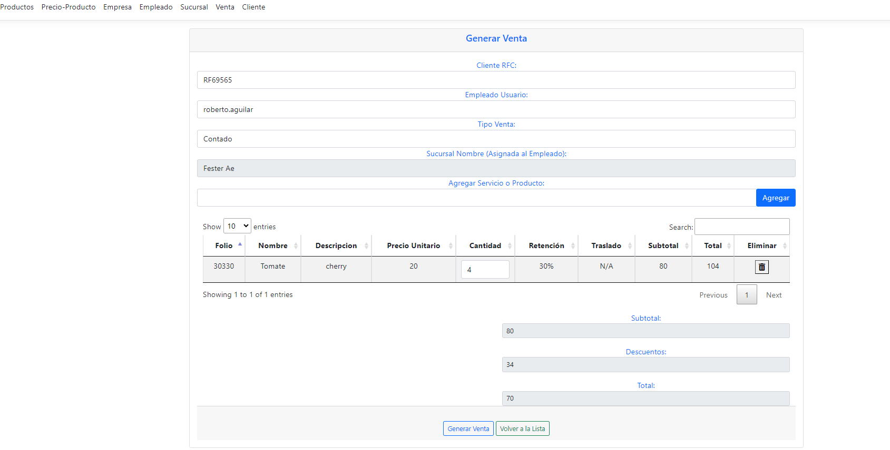

# POSWeb
Proyecto punto de venta

Proyecto Web, tipo API.

#Diagrama entidad relación

 

# Se configura un proyecto tipo ASP.Net Web API con Swagger habilitado
Es una herramienta de software de código abierto para diseñar, construir, documentar, y utilizar servicios web RESTful.
Cuando se encuentra en modo desarrollo en program.cs se pueden visualizar los end-points habilitados.


```csharp
if (app.Environment.IsDevelopment())
{
    app.UseSwagger();
    app.UseSwaggerUI();
}
```

# Generando Venta


# TODO:
1) Acomodar los script en carpetas separadas
2) Crear el modelo relacional
3) Checar la normalización de la base de datos
4) Corregir bug del autocompletado de los productos o servicios
5) Corregir porque no muestra la sucursal del empleado en el select
6) Agregar la creación de tablas query
7) Agregar el campo de teléfonos tipo multivalorado funcionalidad a sucursal
9) Incorporar CRUD para ofertas temporales y logica
10) Agregar campo precio al momento de la venta

# NICE TODO:
1) Agreger pruebas unitarias
2) Agregar pruebas de regresión
3) Incorporar un Login no simulado
